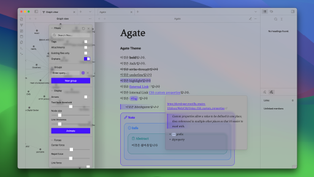
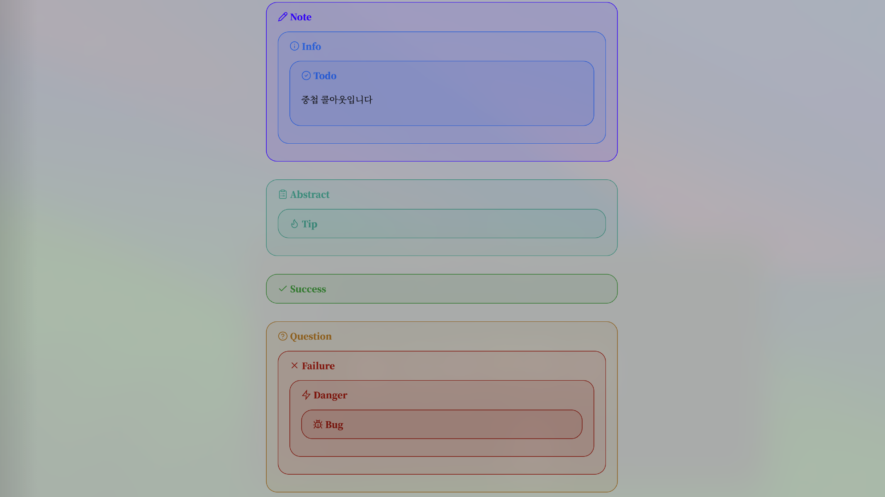
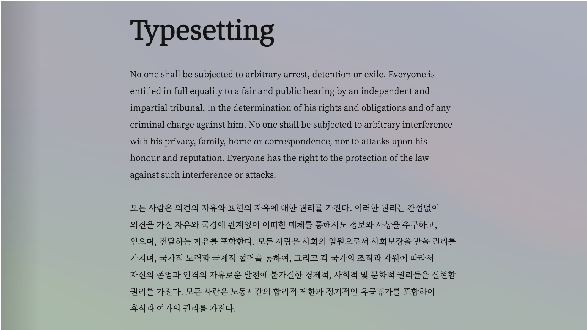
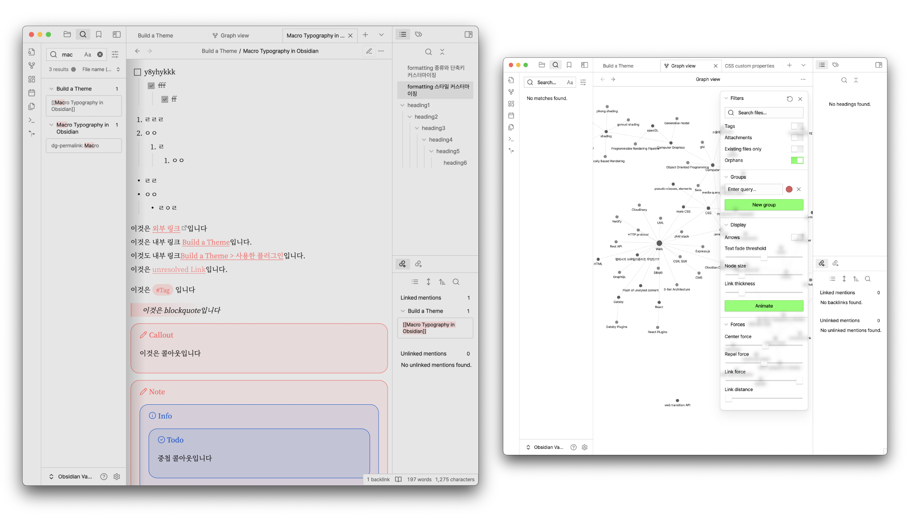
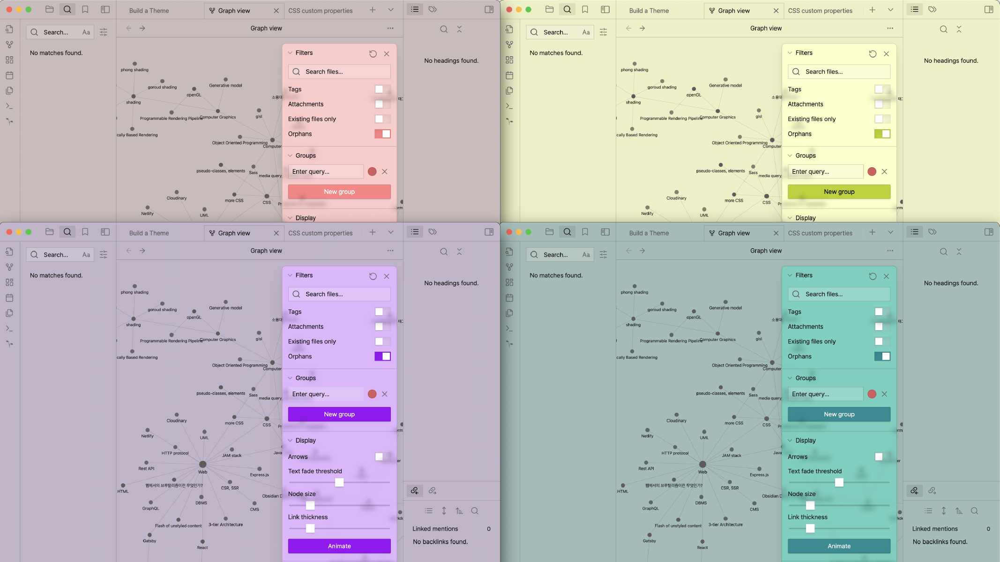

# Agate

> Please turn on *Settings* > *Appearance* > *Translucent window* !



- This is a minimal theme that creates various atmospheres using the overlapping effect of transparent layers.


- I focused extensively on typography to ensure smooth readability.


#### Adjust Color
- You can adjust the accent and background colors using this CSS snippet.
```css
body {
	/* change accent color */
	--accent-color: 55, 0, 255;

	/* change background color */
	--light-color: 170, 170, 170;
	--light-alpha-color: 0;
}
```

- examples


